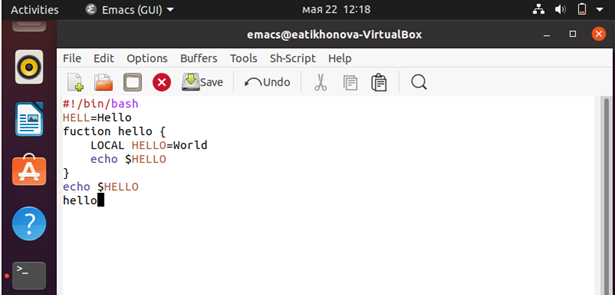
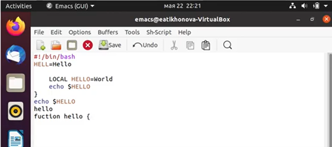
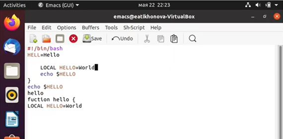

---
## Front matter
lang: ru-RU
title: Отчёт по лабораторной работе №10
author: Тихонова Екатерина Андреевна
institute: РУДН, Москва, Россия
date: 19 мая 2021

## Formatting
toc: false
slide_level: 2
theme: metropolis
header-includes: 
 - \metroset{progressbar=frametitle,sectionpage=progressbar,numbering=fraction}
 - '\makeatletter'
 - '\beamer@ignorenonframefalse'
 - '\makeatother'
aspectratio: 43
section-titles: true
---

## Цель работы

Познакомиться с операционной системой Linux. Получить практические навыки работы с редактором Emacs.

## Откроем редактор Emacs

Откроем редактор Emacs с помощью команды «emacs &».

{ #fig:001 width=70% }

## Создадим файл lab10.sh

Создадим файл lab10.sh с помощью комбинации «Ctrl-x» «Ctrl-f». В открывшемся буфере наберем необходимый текст 

{ #fig:002 width=70% }

## Вырежем командой целую строку и вставим строку в конец файла

Вырежем одной командой целую строку («Сtrl-k»). Вставим эту строку в конец файла («Ctrl-y») (рис. -@fig:003).
   
{ #fig:003 width=70% }

## Скопируем область в буфер обмена и вставим область в конец файла

Выделим область текста («Ctrl-space»). Скопируем область в буфер обмена («Alt-w»). Вставим область в конец файла («Ctrl-y») (рис. -@fig:004).
   
{ #fig:004 width=70% }

## Вновь выделим область и вырежем её

Вновь выделим эту область («Ctrl-space») и на этот раз вырежем её («Ctrl-w») Отменим последнее действие («Ctrl-/») (рис. -@fig:005).
   
{ #fig:005 width=70% }

## Перемещение курсора

- Переместим курсор в начало строки («Ctrl-a»). 
- Переместим курсор в конец строки («Ctrl-e»). 
- Переместим курсор в начало буфера («Alt-<»). 
- Переместим курсор в конец буфера («Alt->») 

## Выведем список активных буферов на экран

Выведем список активных буферов на экран («Ctrl-x» «Ctrl-b») (рис. -@fig:006).
   
{ #fig:006 width=70% }

## В каждом из четырёх созданных окон откроем новый буфер

Поделим фрейм на 4 части: разделим фрейм на два окна по вертикали («Ctrl-x 3»), а затем каждое из этих окон на две части по горизонтали («Ctrl-x 2») (рис. -@fig:007).

{ #fig:007 width=70% }

## Переключимся в режим поиска и найдем несколько слов

Переключимся в режим поиска («Ctrl-s») и найдем несколько слов, присутствующих в тексте (рис. -@fig:008).

{ #fig:008 width=70% }

## Перейдем в режим поиска и замены

Перейдем в режим поиска и замены («Alt-%»), введем текст, который следует найти и заменить, нажмем «Enter», затем введем текст для замены. После того как будут подсвечены результаты поиска, нажмем «!» для подтверждения замены. Важно, чтобы курсор находился в начале текста.
   
## Пробуем другой режим поиска
   
Пробуем другой режим поиска, нажав «Alt-s o» (рис. -@fig:009).

{ #fig:009 width=70% }

## Вывод

В ходе выполнения данной лабораторной работы я познакомилась с операционной системой Linux и получила практические навыки работы с редактором Emacs.

## {.standout}

Спасибо за внимание!
