---
## Front matter
lang: ru-RU
title: Отчёт по лабораторной работе №13
author: Тихонова Екатерина Андреевна
institute: РУДН, Москва, Россия
date: 19 мая 2021

## Formatting
toc: false
slide_level: 2
theme: metropolis
header-includes: 
 - \metroset{progressbar=frametitle,sectionpage=progressbar,numbering=fraction}
 - '\makeatletter'
 - '\beamer@ignorenonframefalse'
 - '\makeatother'
aspectratio: 43
section-titles: true
---

## Цель работы

Изучить основы программирования в оболочке ОС UNIX. Научиться  писать  более  сложные командные  файлы  с  использованием логических управляющих конструкций и циклов.

## Пишем скрипт

Выписала командный  файл,  реализующий  упрощённый  механизм семафоров. Командный файл должен в течение некоторого времени t1 дожидаться освобождения ресурса, выдавая об этом сообщение, а дождавшись  его  освобождения,  использовать  его  в  течение некоторого времени t2<>t1, также выдавая информацию о том, что ресурс   используется   соответствующим   командным   файлом (процессом). Для данной задачи я создала файл: sem.sh и написала соответствующий скрипт

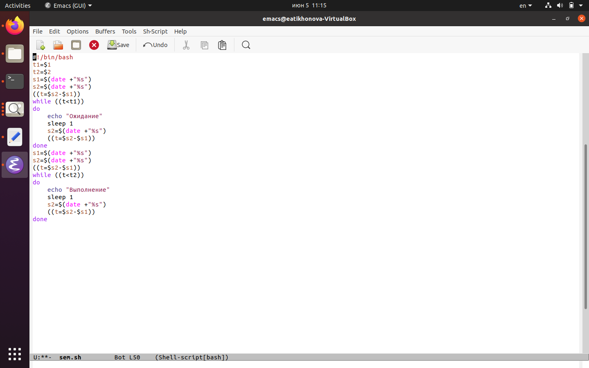{ #fig:001 width=70% }

## Проверяем работу

Далее я проверила работу написанного скрипта(команда«./sem.sh47»), предварительно добавив право на исполнение файла (команда «chmod+xsem.sh») Скрипт работает корректно.

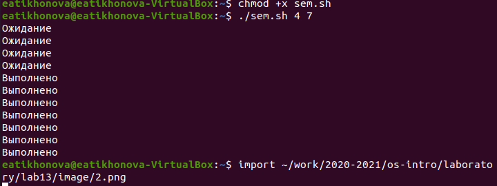{ #fig:002 width=70% }

## Изменила скрипт

После этого я изменила скрипт так,чтобы его можно было выполнять в нескольких  терминалах и  проверила  его  работу (например,  команда «./sem.sh2 3 Ожидание > /dev/pts/1 &»)

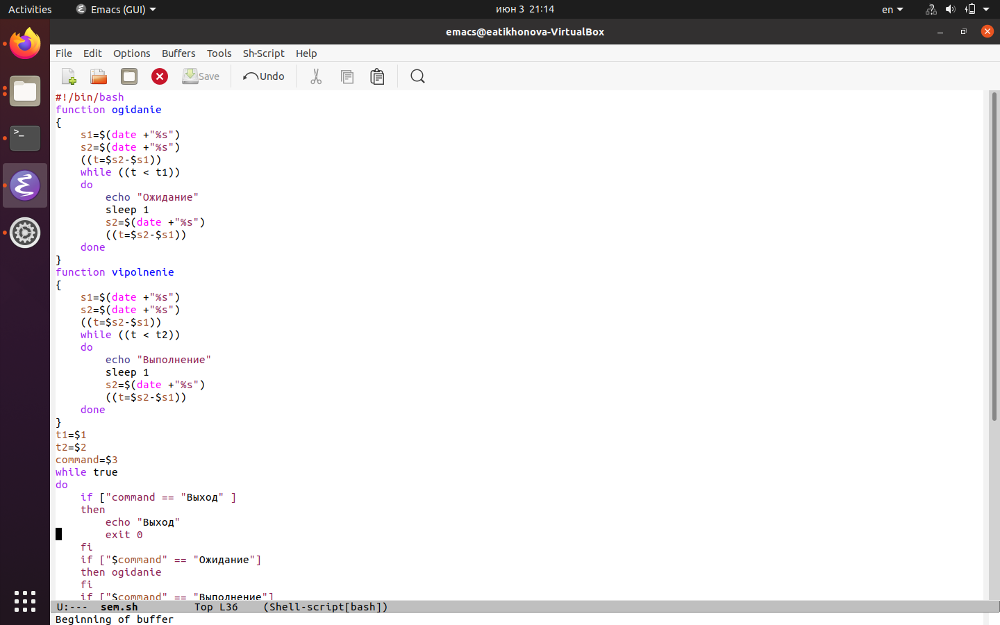{ #fig:003 width=70% }

## Проверяем работу

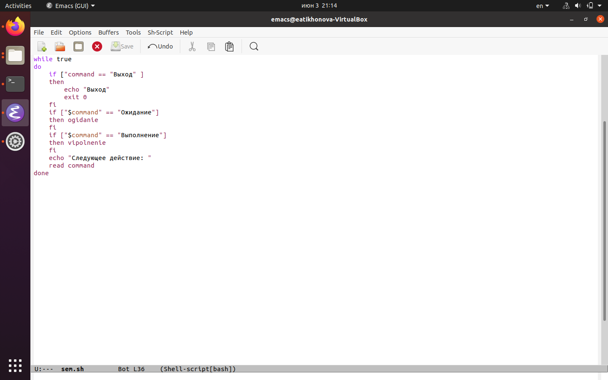{ #fig:004 width=70% }

## Проверяем работу

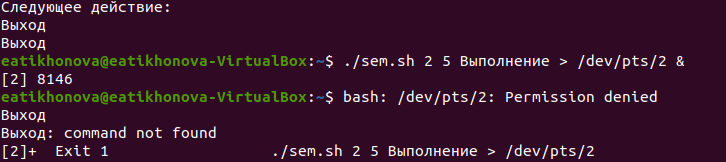{ #fig:005 width=70% }

## Пишем срипт

Реализовала команду manс помощью командного файла. Изучила содержимое  каталога  /usr/share/man/man1.  В  нем находятся  архивы  текстовых  файлов,  содержащих  справку  по большинству установленных в системе программ и команд. Каждый архив  можно  открыть  командой less сразу  же  просмотрев содержимое  справки.  Командный  файл  должен  получать  в  виде аргумента командной строки название команды и в виде результата выдавать  справку  об  этой  команде  или  сообщение  об  отсутствии 
справки, если соответствующего файла нет в каталоге man1.

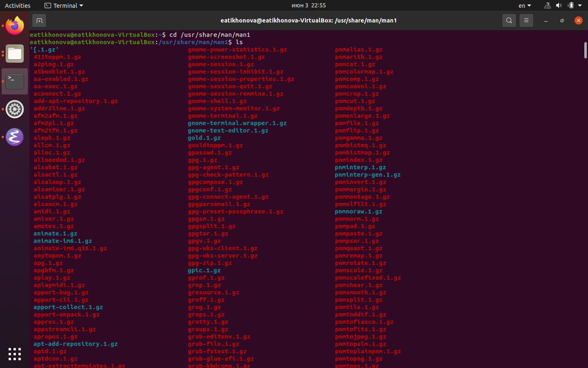{ #fig:006 width=70% }

## Пишем скрипт

Для данной задачи я создала файл: man.sh и написала соответствующий скрипт

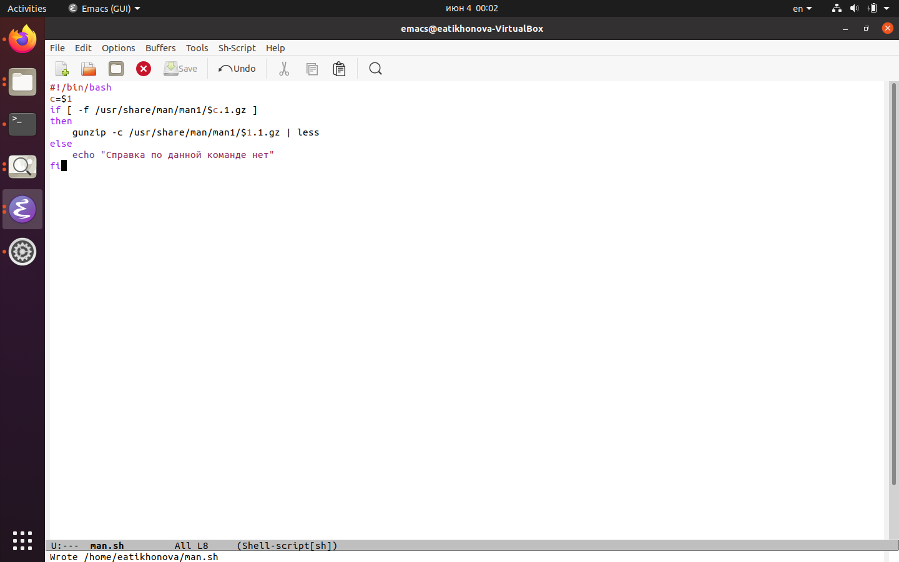{ #fig:007 width=70% }

## Проверяем работу

Далее я проверила работу написанного скрипта(команды«./man.shls»и «./man.shmkdir»),  предварительно  добавив  право  на  исполнение  файла (команда «chmod+xman.sh») 
Скрипт работает корректно.

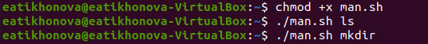{ #fig:008 width=70% }

## Проверяем работу

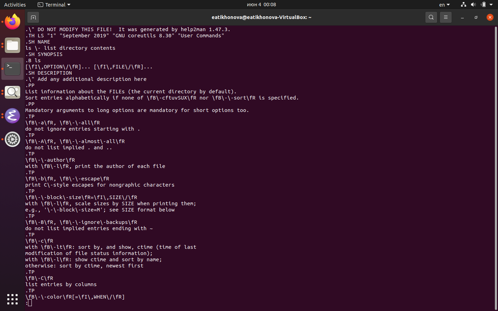{ #fig:009 width=70% }

## Проверяем работу

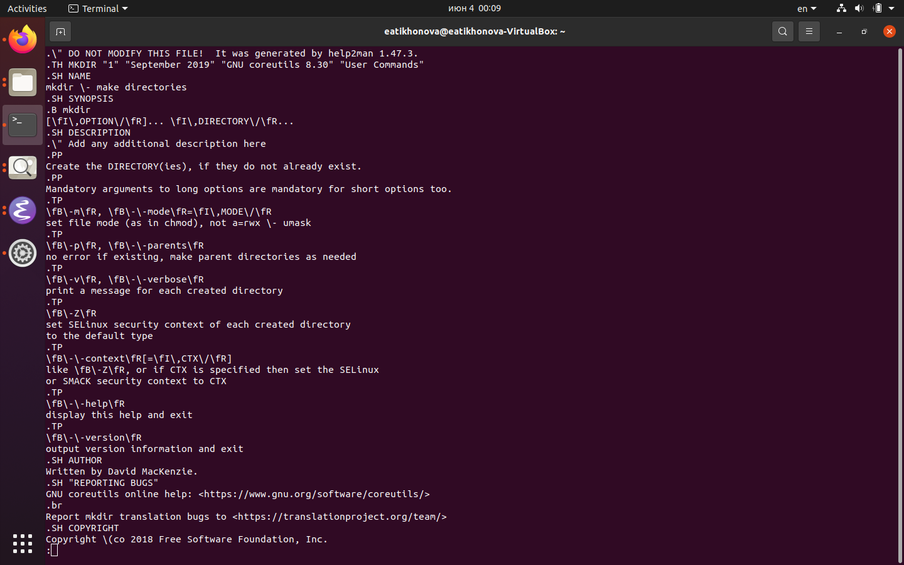{ #fig:010 width=70% }

## Проверяем работу

3. Используя   встроенную   переменную   $RANDOM,   написала командный  файл,  генерирующий  случайную  последовательность букв латинского алфавита. Для данной задачи я создала файл: random.sh и написала соответствующий скрипт

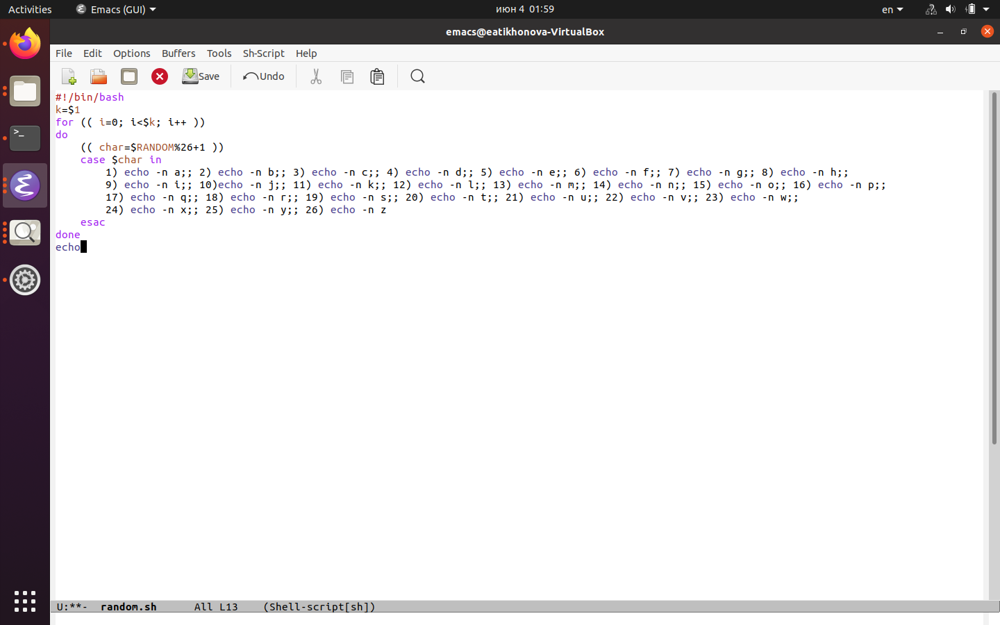{ #fig:011 width=70% }

## Проверяем работу

Далее я проверила работу написанного скрипта(команды «./random.sh7»и «./random.sh15»), предварительно  добавив  право  на  исполнение  файла (команда «chmod+xrandom.sh») Скрипт работает корректно.

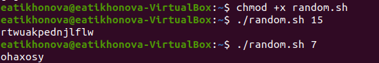{ #fig:012 width=70% }

## Вывод

В ходе выполнения данной лабораторной работы я изучил основы программирования в оболочке ОС UNIX, а также научился писать более сложные командные файлы с использованием логических управляющих конструкций и циклов.

## {.standout}

Спасибо за внимание!
