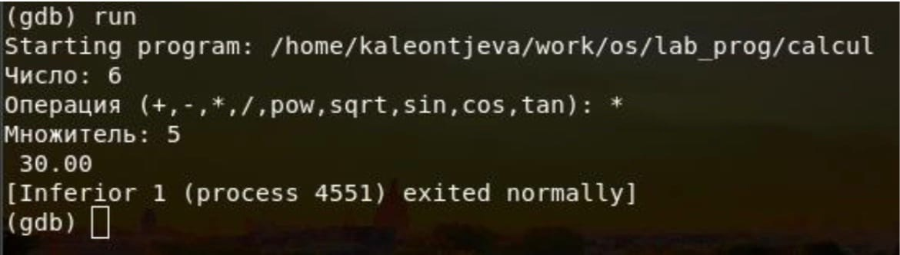
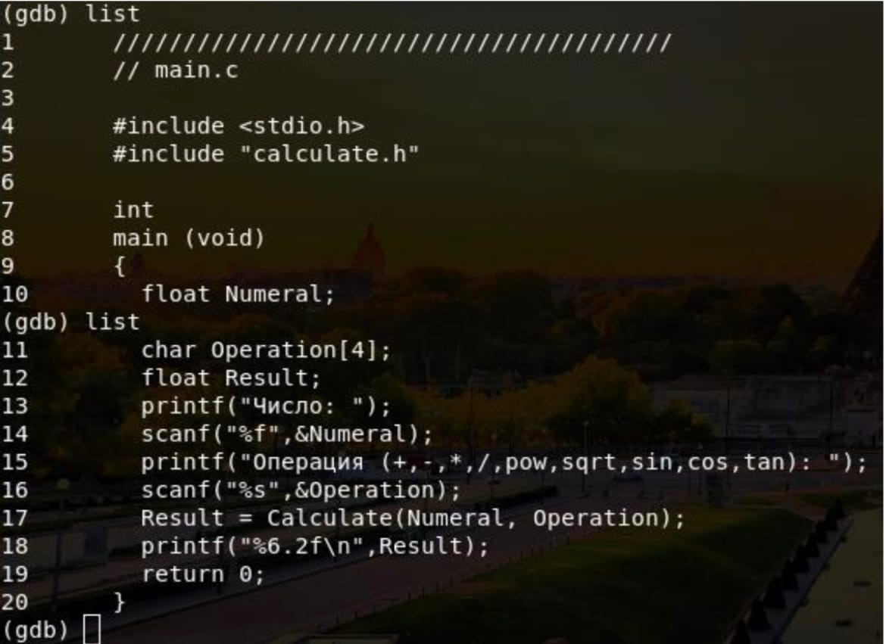
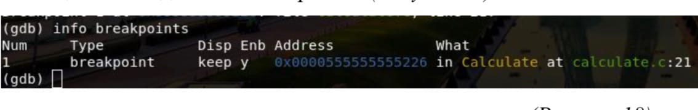
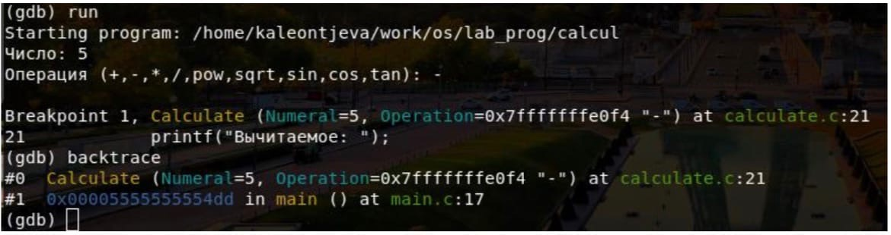
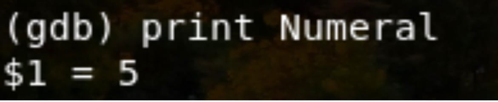
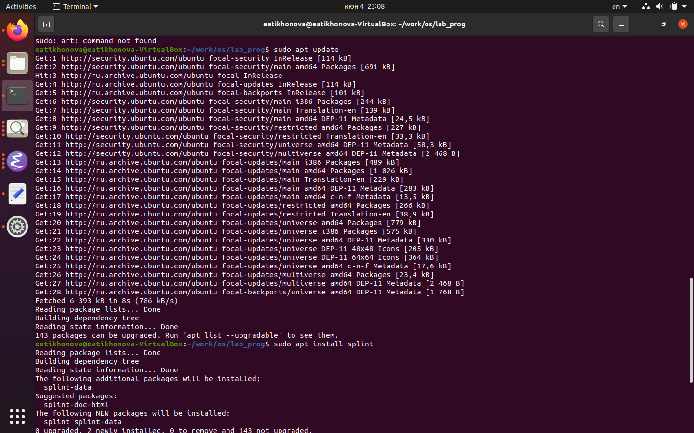
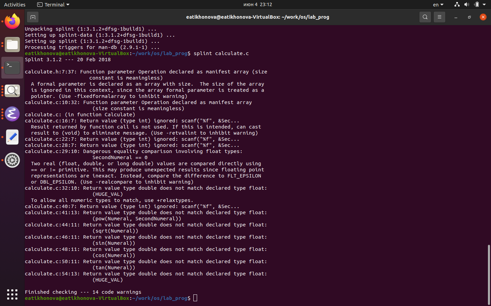

---
## Front matter
lang: ru-RU
title: Отчёт по лабораторной работе №14
author: Тихонова Екатерина Андреевна
institute: РУДН, Москва, Россия
date: 19 мая 2021

## Formatting
toc: false
slide_level: 2
theme: metropolis
header-includes: 
 - \metroset{progressbar=frametitle,sectionpage=progressbar,numbering=fraction}
 - '\makeatletter'
 - '\beamer@ignorenonframefalse'
 - '\makeatother'
aspectratio: 43
section-titles: true
---

## Цель работы

Приобрести  простейшие  навыки  разработки,  анализа, тестирования и отладки приложений в ОС типа UNIX/Linuxна примере создания  на  языке  программирования  С  калькулятора  с  простейшими функциями.

## Создаем подкаталог

1. В  домашнем  каталоге  создаю  подкаталог ~/work/os/lab_progс помощью команды «mkdir-p~/work/os/lab_prog»

{ #fig:001 width=70% }

## Создаем файлы

Создала в каталоге файлы: calculate.h, calculate.c, main.c, используя команды «cd~/work/os/lab_prog»и «touchcalculate.hcalculate.cmain.c»

{ #fig:002 width=70% }

## Редактируем файлы

Это  будет  примитивнейший  калькулятор,  способный  складывать, вычитать,  умножать  и  делить,  возводить  число  в  степень,  брать квадратный корень, вычислять sin, cos, tan. При запуске он будет запрашивать  первое  число,  операцию,  второе  число.  После  этого программа выведет результат и остановится.Открыв редактор Emacs, приступила к редактированию созданных файлов.Реализация функций калькулятора в файле calculate.с

{ #fig:003 width=70% }

## Редактируем файлы

{ #fig:004 width=70% }

## Файл

Интерфейсный файл calculate.h, описывающий формат вызова функции калькулятора

{ #fig:005 width=70% }

## Файл

Основной файл main.c, реализующий интерфейс пользователя к калькулятору 

{ #fig:006 width=70% }

## Компилируем

3. Выполнила компиляцию программы посредством gcc(версия компилятора: 8.3.0-19), используя команды «gcc-ccalculate.c», «gcc-cmain.c» и «gcc calculate.o main.o-o calcul-lm»

{ #fig:007 width=70% }

## Проверяем работу

4. В ходе компиляции программы никаких ошибок выявлено не было. 
5. Создала Makefile с необходимым содержанием

{ #fig:008 width=70% }

## Создаем файл

Данный файл необходим для автоматической компиляции файлов calculate.c (цель calculate.o), main.c (цель main.o), а также их объединения в один исполняемый файл calcul(цель calcul). Цель clean нужна для автоматического удаления файлов. Переменная CC отвечает за утилиту для компиляции. Переменная CFLAGS отвечает за опции в данной утилите. Переменная LIBS отвечает за опции для объединения объектных файлов в один исполняемый файл.
6. Далее исправила Makefile

{ #fig:009 width=70% }

## Выполниляем компиляцию

В переменную CFLAGS добавила опцию-g, необходимую для
компиляции объектных файлов и их использования в программе отладчика GDB. Сделала так, что утилита компиляции выбирается с помощью переменной CC. После этого я удалила исполняемые и объектные файлы из каталога с помощью команды «makeclear». Выполнила компиляцию файлов, используя команды «makecalculate.o», «makemain.o», «malecalcul»

{ #fig:010 width=70% }

## Выполниляем компиляцию

{ #fig:011 width=70% }

## Выполняем отладку

Далее с помощью gdb выполнила отладку программы calcul. Запустила отладчик GDB, загрузив в него программу для отладки, используя команду:«gdb./calcul»

{ #fig:012 width=70% }

## Ввела команду

Для запуска программы внутри отладчика ввела команду «run»

{ #fig:013 width=70% }

## Используем команду

Для постраничного (по 10 строк) просмотра исходного кода использовала команду «list»

{ #fig:014 width=70% }

## Проверяем работу

Для просмотра строк с 12 по 15 основного файла использовала команду «list 12, 15»

{ #fig:015 width=70% }

## Используем команду.

Написала командный файл, который получает в качестве аргумента
командной строки формат файла (.txt, .doc, .jpg, .pdf и т.д.) и вычисляет
количество таких файлов в указанной директории. Путь к директории
также передаётся в виде аргумента командной строки

{ #fig:016 width=70% }

## Используем команду

Установила точку останова в файле calculate.c на строке номер 21,
используя команды «listcalculate.c: 20, 27» и «break 21»

{ #fig:017 width=70% }

## Используем команду

Установила точку останова в файле calculate.c на строке номер 21,
используя команды «listcalculate.c: 20, 27» и «break 21»

{ #fig:018 width=70% }

## Используем команду

Установила точку останова в файле calculate.c на строке номер 21,
используя команды «listcalculate.c: 20, 27» и «break 21»

{ #fig:019 width=70% }

## Используем команду

Установила точку останова в файле calculate.c на строке номер 21,
используя команды «listcalculate.c: 20, 27» и «break 21»

{ #fig:020 width=70% }

## Используем команду

Установила точку останова в файле calculate.c на строке номер 21,
используя команды «listcalculate.c: 20, 27» и «break 21»

{ #fig:021 width=70% }

## Используем команду

Установила точку останова в файле calculate.c на строке номер 21,
используя команды «listcalculate.c: 20, 27» и «break 21»

{ #fig:022 width=70% }

## Используем команду

Установила точку останова в файле calculate.c на строке номер 21,
используя команды «listcalculate.c: 20, 27» и «break 21»

{ #fig:023 width=70% }

## Используем команду

Далее воспользовалась командами «splintcalculate.c» и «splintmain.c». C помощью утилиты splint выяснилось, что в файлах calculate.c и main.c присутствует функция чтения scanf, возвращающая целое число(тип int), но эти числа не используются и нигде не сохранятся. Утилита вывела предупреждение о том, что в файле calculate.c происходит сравнение вещественного числа с нулем. Также возвращаемые значения(тип double) в функциях pow, sqrt, sin, cos и tan записываются в переменную типа float, что свидетельствует о потери данных.

{ #fig:024 width=70% }

## Используем команду

{ #fig:025 width=70% }

## Вывод

В  ходе  выполнения  данной  лабораторной  работы  я  приобрелапростейшие  навыки  разработки,  анализа,  тестирования  и  отладки приложений  в  ОС  типа UNIX/Linuxна  примере  создания  на  языке программирования С калькулятора с простейшими функциями.

## {.standout}

Спасибо за внимание!
