---
## Front matter
lang: ru-RU
title: Отчёт по лабораторной работе №11
author: Тихонова Екатерина Андреевна
institute: РУДН, Москва, Россия
date: 19 мая 2021

## Formatting
toc: false
slide_level: 2
theme: metropolis
header-includes: 
 - \metroset{progressbar=frametitle,sectionpage=progressbar,numbering=fraction}
 - '\makeatletter'
 - '\beamer@ignorenonframefalse'
 - '\makeatother'
aspectratio: 43
section-titles: true
---

## Цель работы

Изучить основы программирования в оболочке ОС
UNIX/Linux. Научиться писать небольшие командные файлы.

## Используем команды

Для начала я изучила команды архивации, используя команды «man
zip», «man bzip2», «man tar»

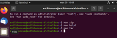{ #fig:001 width=70% }

## Смотрим на синтаксис

Синтаксис команды zip для архивации файла:
zip [опции] [имя файла.zip] [файлы или папки, которые будем
архивировать]
Синтаксис команды zip для разархивации/распаковки файла:
unzip [опции] [файл_архива.zip] [файлы] -x [исключить] -d [папка]

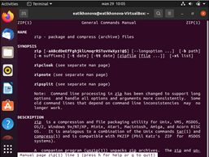{ #fig:002 width=70% }

## Смотрим на синтаксис

Синтаксис команды bzip2 для архивации файла:
bzip2 [опции] [имена файлов]
Синтаксис команды bzip2 для разархивации/распаковки файла:
bunzip2 [опции] [архивы.bz2] 

{ #fig:003 width=70% }

## Смотрим на синтаксис

Синтаксис команды tar для архивации файла:
tar [опции] [архив.tar] [файлы_для_архивации]
Синтаксис команды tar для разархивации/распаковки файла:
tar [опции] [архив.tar]

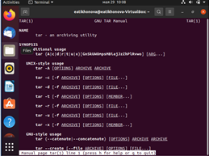{ #fig:004 width=70% }

## Создаем и открываем файл

Далее я создала файл, в котором буду писать первый скрипт, и открыла
его в редакторе emacs, используя клавиши «Ctrl-x» и «Ctrl-f» (команды
«touch backup.sh» и «emacs &»)

{ #fig:005 width=70% }

## Пишем срипт

После написала скрипт, который при запуске будет делать резервную
копию самого себя (то есть файла, в котором содержится его исходный
код) в другую директорию backup в вашем домашнем каталоге. При
этом файл должен архивироваться одним из архиваторов на выбор zip,
bzip2 или tar. При написании скрипта использовала
архиватор bzip2.

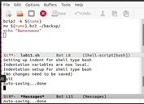{ #fig:006 width=70% }

## Проверяем работу

Проверила работу скрипта (команда «./backup.sh»), предварительно
добавив для него право на выполнение (команда «chmod +x *.sh»).
Проверила, появился ли каталог backup/, перейдя в него (команда «cd
backup/»), посмотрела его содержимое (команда «ls») и просмотрела
содержимое архива (команда «bunzip2 -c backup.sh.bz2») (Рисунки 7, 8).
Скрипт работает корректно.

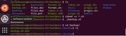{ #fig:007 width=70% }
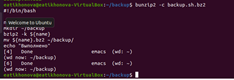{ #fig:008 width=70% }

## Создаем файл

2. Создала файл, в котором буду писать второй скрипт, и открыла его в
редакторе emacs, используя клавиши «Ctrl-x» и «Ctrl-f» (команды «touch
prog2.sh» и «emacs &»)

{ #fig:009 width=70% }

## Пишем пример

Написала пример командного файла, обрабатывающего любое
произвольное число аргументов командной строки, в том числе
превышающее десять. Например, скрипт может последовательно 
распечатывать значения всех переданных аргументов. 

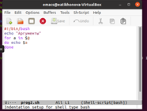{ #fig:010 width=70% }

## Проверяем работу

Проверила работу написанного скрипта (команды «./prog2.sh 0 1 2 3 4»
и «./prog2.sh 0 1 2 3 4 5 6 7 8 9 10 11»), предварительно добавив для него
право на выполнение (команда «chmod +x *.sh»). Вводила аргументы,
количество которых меньше 10 и больше 10.
Скрипт работает корректно.

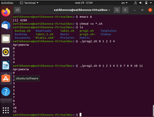{ #fig:011 width=70% }

## Создала файл

3. Создала файл, в котором буду писать третий скрипт, и открыла его в
редакторе emacs, используя клавиши «Ctrl-x» и «Ctrl-f» (команды «touch
progls.sh» и «emacs &») 

{ #fig:012 width=70% }

## Пишем командный файл

Написала командный файл − аналог команды ls (без использования
самой этой команды и команды dir). Он должен выдавать информацию 
о нужном каталоге и выводить информацию о возможностях доступа к
файлам этого каталога.

{ #fig:013 width=70% }

## Проверяем работу

Далее проверила работу скрипта (команда «./progls.sh ~»),
предварительно добавив для него право на выполнение (команда
«chmod +x *.sh»).
Скрипт работает корректно.

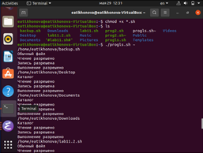{ #fig:014 width=70% }

## Проверяем работу

4. Для четвертого скрипта также создала файл (команда «touch
format.sh») и открыла его в редакторе emacs, используя клавиши «Ctrlx» и «Ctrl-f» (команда «emacs &»)

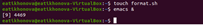{ #fig:015 width=70% }

## Пишем командный файл.

Написала командный файл, который получает в качестве аргумента
командной строки формат файла (.txt, .doc, .jpg, .pdf и т.д.) и вычисляет
количество таких файлов в указанной директории. Путь к директории
также передаётся в виде аргумента командной строки

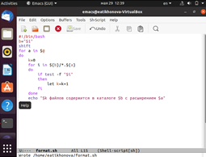{ #fig:016 width=70% }

## Проверяем работу

Проверила работу написанного скрипта (команда «./format.sh ~ pdf sh txt
doc»), предварительно добавив для него право на выполнение (команда
«chmod +x *.sh»), а также создав дополнительные файлы с разными
расширениями (команда «touch file.pdf file1.doc file2.doc»).
Скрипт работает корректно.

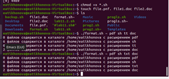{ #fig:017 width=70% }

## Вывод

В ходе выполнения данной лабораторной работы я изучила основы
программирования в оболочке ОС UNIX/Linux и научилась писать
небольшие командные файлы.

## {.standout}

Спасибо за внимание!
