---
# Front matter
lang: ru-RU
title: "Отчет по лабораторной работе №10"
subtitle: "Дисциплина: Операционные системы"
author: "Тихонова Екатерина Андреевна"

# Formatting
toc-title: "Содержание"
toc: true # Table of contents
toc_depth: 2
lof: true # List of figures
lot: true # List of tables
fontsize: 12pt
linestretch: 1.5
papersize: a4paper
documentclass: scrreprt
polyglossia-lang: russian
polyglossia-otherlangs: english
mainfont: PT Serif
romanfont: PT Serif
sansfont: PT Sans
monofont: PT Mono
mainfontoptions: Ligatures=TeX
romanfontoptions: Ligatures=TeX
sansfontoptions: Ligatures=TeX,Scale=MatchLowercase
monofontoptions: Scale=MatchLowercase
indent: true
pdf-engine: lualatex
header-includes:
  - \linepenalty=10 # the penalty added to the badness of each line within a paragraph (no associated penalty node) Increasing the value makes tex try to have fewer lines in the paragraph.
  - \interlinepenalty=0 # value of the penalty (node) added after each line of a paragraph.
  - \hyphenpenalty=50 # the penalty for line breaking at an automatically inserted hyphen
  - \exhyphenpenalty=50 # the penalty for line breaking at an explicit hyphen
  - \binoppenalty=700 # the penalty for breaking a line at a binary operator
  - \relpenalty=500 # the penalty for breaking a line at a relation
  - \clubpenalty=150 # extra penalty for breaking after first line of a paragraph
  - \widowpenalty=150 # extra penalty for breaking before last line of a paragraph
  - \displaywidowpenalty=50 # extra penalty for breaking before last line before a display math
  - \brokenpenalty=100 # extra penalty for page breaking after a hyphenated line
  - \predisplaypenalty=10000 # penalty for breaking before a display
  - \postdisplaypenalty=0 # penalty for breaking after a display
  - \floatingpenalty = 20000 # penalty for splitting an insertion (can only be split footnote in standard LaTeX)
  - \raggedbottom # or \flushbottom
  - \usepackage{float} # keep figures where there are in the text
  - \floatplacement{figure}{H} # keep figures where there are in the text
---

# Цель работы

Познакомиться с операционной системой Linux. Получить практические навыки работы с редактором Emacs.

# Задание

1.	Открыть emacs.
2.	Создать файл lab07.sh с помощью комбинации Ctrl-x Ctrl-f ( C-x C-f ).
3.	Наберите текст.
4.	Сохранить файл с помощью комбинации Ctrl-x Ctrl-s ( C-x C-s ).
5.	Проделать с текстом стандартные процедуры редактирования, каждое действие должно осуществляться комбинацией клавиш.
1.	Вырезать одной командой целую строку ( С-k ).
2.	Вставить эту строку в конец файла ( C-y ).
3.	Выделить область текста ( C-space ).
4.	Скопировать область в буфер обмена ( M-w ).
5.	Вставить область в конец файла.
6.	Вновь выделить эту область и на этот раз вырезать её ( C-w ).
7.	Отмените последнее действие ( C-/ ).
6.	Научитесь использовать команды по перемещению курсора.
1.	Переместите курсор в начало строки ( C-a ).
2.	Переместите курсор в конец строки ( C-e ).
3.	Переместите курсор в начало буфера ( M-< ).
4.	Переместите курсор в конец буфера ( M-> ).
7.	Управление буферами.
1.	Вывести список активных буферов на экран ( C-x C-b ).
2.	Переместитесь во вновь открытое окно ( C-x ) o со списком открытых буферов и переключитесь на другой буфер.
3.	Закройте это окно ( C-x 0 ).
4.	Теперь вновь переключайтесь между буферами, но уже без вывода их списка на экран ( C-x b ).
8.	Управление окнами.
1.	Поделите фрейм на 4 части: разделите фрейм на два окна по вертикали ( C-x 3 ), а затем каждое из этих окон на две части по горизонтали ( C-x 2 ).
2.	В каждом из четырёх созданных окон откройте новый буфер (файл) и введите несколько строк текста.
9.	Режим поиска
1.	Переключитесь в режим поиска ( C-s ) и найдите несколько слов, присутствующих в тексте.
2.	Переключайтесь между результатами поиска, нажимая C-s .
3.	Выйдите из режима поиска, нажав C-g .
4.	Перейдите в режим поиска и замены ( M-% ), введите текст, который следует найти и заменить, нажмите Enter , затем введите текст для замены. После того как будут подсвечены результаты поиска, нажмите ! для подтверждения замены.
5.	Испробуйте другой режим поиска, нажав M-s o . Объясните, чем он отличается от обычного режима.

# Выполнение лабораторной работы

1.	Для работы с Emacs необходимо установить данный редактор, используя команды «sudo apt-get install emacs»

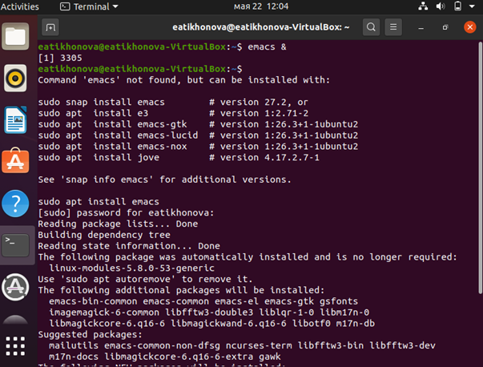{ #fig:001 }
 
2.	Откроем редактор Emacs с помощью команды «emacs &» 
{ #fig:002 }

3.	Создадим файл lab10.sh с помощью комбинации «Ctrl-x» «Ctrl-f».
4.	В открывшемся буфере наберем необходимый текст 

{ #fig:003 }

5.	Сохраним файл с помощью комбинации «Ctrl-x» «Ctrl-s».
6.	
	1.Вырежем одной командой целую строку («Сtrl-k»).
	2.Вставим эту строку в конец файла («Ctrl-y») 

{  #fig:004 }

3.	Выделим область текста («Ctrl-space»).
4.	Скопируем область в буфер обмена («Alt-w»).
5.	Вставим область в конец файла («Ctrl-y») 

{  #fig:005  }

6.	Вновь выделим эту область («Ctrl-space») и на этот раз вырежем её («Ctrl-w») 

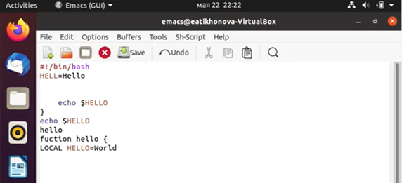{  #fig:006 }

7.	Отменим последнее действие («Ctrl-/») 

{ #fig:007 }

	1.Переместим курсор в начало строки («Ctrl-a»)

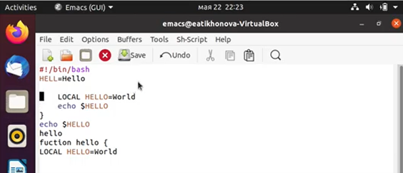{ #fig:008 }

	2.Переместим курсор в конец строки («Ctrl-e») 

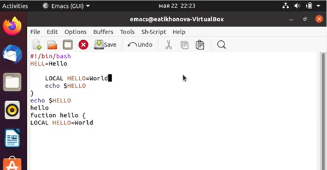{ #fig:009 }

    3.Переместим курсор в начало буфера («Alt-<») 

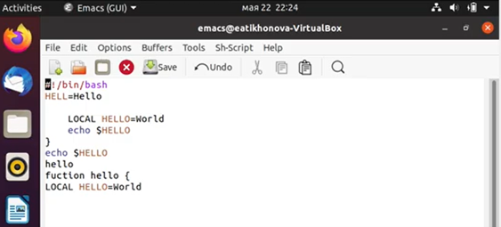{ #fig:010 }

    4.Переместим курсор в конец буфера («Alt->») 

{ #fig:011 }

    1.Выведем список активных буферов на экран («Ctrl-x» «Ctrl-b») 

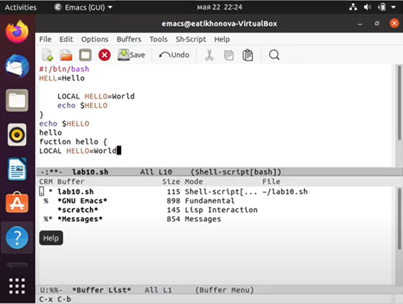{ #fig:012 }

    2.Переместимся во вновь открытое окно («Ctrl-x o») со списком открытых буферов (рис. -fig. 13) и переключимся на другой буфер (для этого необходимо нажать на «enter» после выбора необходимого буфера) 

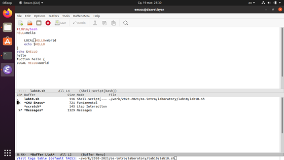{ #fig:013 }

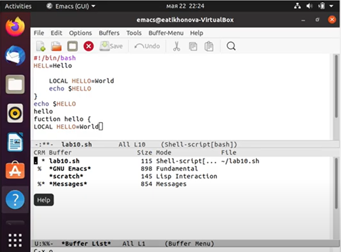{ #fig:014 }

    3.Закроем это окно («Ctrl-x 0»).
    4.Теперь вновь переключимся между буферами, но уже без вывода их списка на экран («Ctrl-x b»)

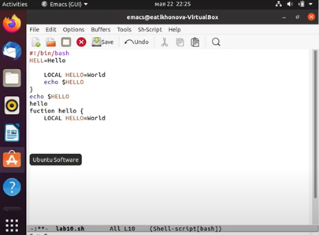{ #fig:015 }
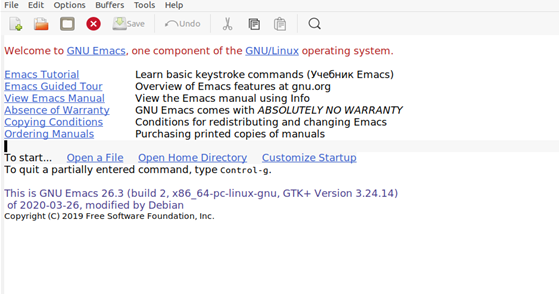{ #fig:016 }

    1.Поделим фрейм на 4 части: разделим фрейм на два окна по вертикали («Ctrl-x 3»), а затем каждое из этих окон на две части по горизонтали («Ctrl-x 2»).
    2.В каждом из четырёх созданных окон откроем новый буфер (файл) и введем несколько строк текста 

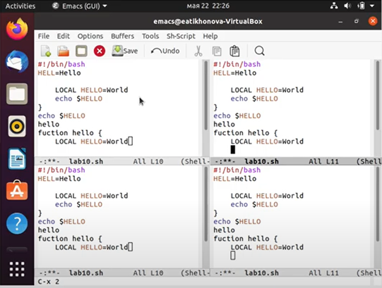{ #fig:017 }

10.	1.Переключимся в режим поиска («Ctrl-s») и найдем несколько слов, присутствующих в тексте 

{ #fig:018  }

    2.Переключимся между результатами поиска, нажимая «Ctrl-s» 

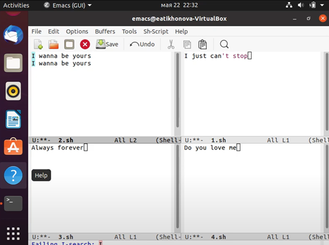{ #fig:019 }

    3.Выйдем из режима поиска, нажав «Ctrl-g».
    4.Перейдем в режим поиска и замены («Alt-%»), введем текст, который следует найти и заменить, нажмем «Enter», затем введем текст для замены. После того как будут подсвечены результаты поиска, нажмем «!» для подтверждения замены. Важно, чтобы курсор находился в начале текста.

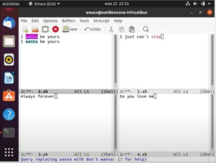{ #fig:020 }

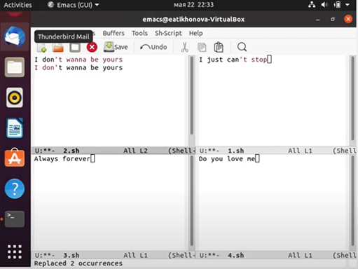{ #fig:021 }

    5.Пробуем другой режим поиска, нажав «Alt-s o» 

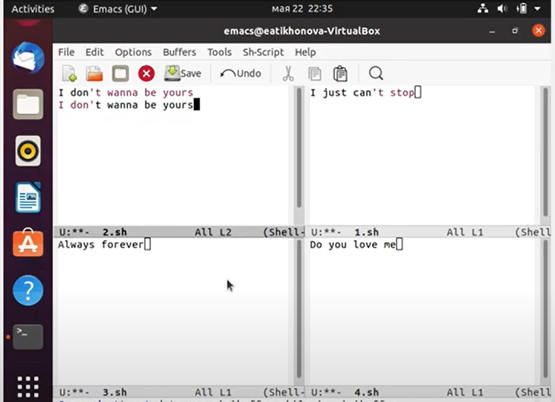{ #fig:022 }

Данный вид поиска отличается от обычного тем, что тут считывается строка поиска, которая трактуется как регулярное выражение, и не осуществляется поиск точного совпадения в тексте буфера. Регулярное выражение − это образец, который обозначает набор строк, возможно, и неограниченный набор.

# Контрольные вопросы:

1.	Emacs − один из наиболее мощных и широко распространённых редакторов, используемых в мире Unix. По популярности он соперничает с редактором vi и его клонами. В зависимости от ситуации, Emacs может быть:
•	текстовым редактором;
•	программой для чтения почты и новостей Usenet;
•	интегрированной средой разработки (IDE);
•	операционной системой и т.д.
Всё это разнообразие достигается благодаря архитектуре Emacs, которая позволяет расширять возможности редактора при помощи языка Emacs Lisp. На языке C написаны лишь самые базовые и низкоуровневые части Emacs, включая полнофункциональныйинтерпретатор языка Lisp. Таким образом, Emacs имеет встроенный язык программирования, который может использоваться для настройки, расширения и изменения поведения редактора. В действительности, большая часть того редактора, с которым пользователи Emacs работают в наши дни, написана на языке Lisp.
2.	Основную трудность для новичков при освоении данного редактора могут составлять большое количество команд, комбинаций клавиш, которые не получится все запомнить с первого раза и поэтоу придется часто обращаться к справочным материалам.
3.	Буфер – это объект, представляющий собой текст. Если имеется несколько буферов, то редактировать можно только один. Обычно буфер считывает данные из файла или записывает в файл данные из буфера.
Окно – это область экрана, отображающая буфер. При запуске редактора отображается одно окно, но при обращении к некоторым функциям могут открыться дополнительные окна. Окна Emacs и окна графической среды X Window – разные вещи. Одно окно X Window может быть разбито на несколько окон в смысле Emacs, в каждом из которых отображается отдельный буфер.
4.	Да, можно.
5.	При запуске Emacs по умолчанию создаются следующие буферы:
•	«scratch» (буфер для несохраненного текста)
•	«Messages» (журнал ошибок, включающий также информацию, которая появляется в области EchoArea)
•	«GNU Emacs» (справочный буфер о редакторе)
6.	C-c | сначала, удерживая «ctrl», нажимаю «c», после – отпускаю обе клавиши и нажимаю «|»
C-c C-| сначала, удерживая «ctrl», нажимаю «с», после – отпускаю обе клавиши и, удерживая «ctrl», нажимаю «|»
7.	Чтобы поделить окно на две части необходимо воспользоваться комбинацией «Ctrl-x 3» (по вертикали) или «Ctrl-x 2» (по горизонтали).
8.	Настройки Emacs хранятся в файле .emacs.
9.	По умолчанию клавиша «Backspace» удаляет символ перед курсором, но в редакторе её можно переназначить. Для этого необхдимо изменить конфигурацию файла .emacs.
10.	Более удобным я считаю редактор emacs, потому что в нем проще открывать другие файлы, можно использовать сразу несколько окон, нет «Командного режима», «Режима ввода», «Режима командной строки», которые являются немного непривычными и в какой-то степени неудобными.

# Выводы

В ходе выполнения данной лабораторной работы я познакомился с операционной системой Linux и получил практические навыки работы с редактором Emacs.

